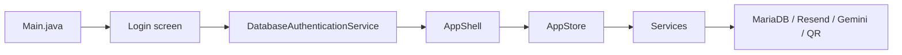

# QR Attend V2

QR Attend V2 is a Java Swing attendance app for schools.

It has two users:

- `Admin`
  - adds teachers
  - saves sections, subjects, and rooms
  - adds students by section
  - builds class schedules
  - reviews teacher requests
  - checks reports
- `Teacher`
  - opens attendance
  - scans student QR codes
  - marks attendance by clicking a student when QR fails
  - checks the class list
  - asks for schedule changes
  - asks the admin to remove a student from the class list
  - asks AI about attendance and reports

This README is written for a beginner developer. The goal is to help you understand:

- how the app starts
- how the screens connect
- where the main code lives
- how the database is used

## Start Here

Open these files first:

1. [Main.java](/C:/Users/kael/Documents/NetBeansProjects/ppb.qrattend/src/ppb/qrattend/main/Main.java)
2. [AppShell.java](/C:/Users/kael/Documents/NetBeansProjects/ppb.qrattend/src/ppb/qrattend/app/AppShell.java)
3. [AppStore.java](/C:/Users/kael/Documents/NetBeansProjects/ppb.qrattend/src/ppb/qrattend/app/AppStore.java)
4. [CoreModels.java](/C:/Users/kael/Documents/NetBeansProjects/ppb.qrattend/src/ppb/qrattend/model/CoreModels.java)
5. one screen file, like:
   - [AttendanceScreen.java](/C:/Users/kael/Documents/NetBeansProjects/ppb.qrattend/src/ppb/qrattend/app/AttendanceScreen.java)
   - [AdminStudentsScreen.java](/C:/Users/kael/Documents/NetBeansProjects/ppb.qrattend/src/ppb/qrattend/app/AdminStudentsScreen.java)
   - [TeacherScheduleScreen.java](/C:/Users/kael/Documents/NetBeansProjects/ppb.qrattend/src/ppb/qrattend/app/TeacherScheduleScreen.java)

## How The App Works

Plain version:

1. `Main.java` opens the login screen.
2. `DatabaseAuthenticationService` checks the email, password, and role in MariaDB.
3. If login is correct, `AppShell` opens the admin or teacher workspace.
4. Each screen asks `AppStore` for data or actions.
5. `AppStore` calls the service classes.
6. Services talk to:
   - MariaDB for saved data
   - Resend for email
   - Gemini for AI chat
   - QR utilities for QR create/scan work

## Main UI Idea

This version is built to be simple:

- small left menu
- one main work area
- one main task first
- saved school lists instead of repeated typing
- teachers click student buttons for backup attendance
- attendance page refreshes its class status automatically while open

Important UI pages:

- Admin
  - Home
  - Teachers
  - School Lists
  - Students
  - Schedule
  - Requests
  - Reports
- Teacher
  - Home
  - Attendance
  - My Class List
  - My Schedule
  - Reports

## Database Setup

This rebuild uses one fresh schema file:

- [qrattend_full_schema.sql](/C:/Users/kael/Documents/NetBeansProjects/ppb.qrattend/database/qrattend_full_schema.sql)

Run that file in MariaDB/XAMPP.

This version does not depend on the old migrations or old advanced tables.

The new main tables are:

- `users`
- `sections`
- `subjects`
- `rooms`
- `students`
- `schedules`
- `schedule_requests`
- `student_removal_requests`
- `attendance_sessions`
- `attendance_records`
- `email_logs`

## Configuration

Copy:

- [database.properties.example](/C:/Users/kael/Documents/NetBeansProjects/ppb.qrattend/config/database.properties.example)

to:

- `config/database.properties`

Then set:

- `db.enabled=true`
- `db.url`
- `db.username`
- `db.password`
- `mail.enabled`
- `mail.apiKey`
- `mail.fromEmail`
- `ai.enabled`
- `ai.apiKey`

The app uses `PHT` (`Asia/Manila`) for class-time checks and the default database timezone.

## Seed Login

The fresh schema adds one admin account:

- email: `admin@qrattend.local`
- password: `admin123`

Teachers are created by the admin inside the app.

## Active Packages

- `main`
  - app startup
- `app`
  - shell and screen classes
- `model`
  - simple records and enums
- `service`
  - real business logic
- `db`
  - database config, auth, helpers
- `email`
  - Resend integration
- `ai`
  - Gemini client pieces
- `qr`
  - QR create/scan support

## Best Reading Order

1. this README
2. [System Overview](docs/system-overview.md)
3. [UI Flow](docs/ui-flow.md)
4. [Feature Processes](docs/feature-processes.md)
5. [Database](docs/database.md)
6. [Code Map](docs/code-map.md)

## Docs

- [System Overview](docs/system-overview.md)
- [UI Flow](docs/ui-flow.md)
- [Feature Processes](docs/feature-processes.md)
- [Database](docs/database.md)
- [Code Map](docs/code-map.md)
