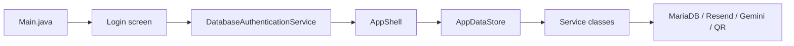

# QR Attend

QR Attend is a Java Swing school attendance system.

The goal of the project is simple:

- admins set up teachers, students, and class schedules
- teachers take attendance with QR codes
- teachers can still mark attendance without QR if needed
- teachers can ask AI to explain attendance or reports in plain language

This README is written for a beginner programmer who wants to understand the app, run it, and know which file to open first.

## 1. What the app does

### Admin can:

- add teacher accounts
- add students by section
- set class schedules
- approve schedule change requests
- approve student removal requests
- view reports

### Teacher can:

- start attendance
- scan student QR codes
- mark attendance without QR if scanning fails
- check the class list
- ask for schedule changes
- ask the admin to remove a student from the class list
- ask AI questions about attendance and reports

## 2. Main app flow

In plain words:

1. `Main.java` starts the app
2. the user signs in
3. login is checked in the database
4. `AppShell` opens the admin or teacher workspace
5. screens ask `AppDataStore` for data
6. `AppDataStore` calls the service classes
7. services talk to MariaDB or outside APIs

## 3. Files to open first

If you are new to the codebase, open these first:

1. [`src/ppb/qrattend/main/Main.java`](src/ppb/qrattend/main/Main.java)
2. [`src/ppb/qrattend/app/AppShell.java`](src/ppb/qrattend/app/AppShell.java)
3. [`src/ppb/qrattend/app/AppDataStore.java`](src/ppb/qrattend/app/AppDataStore.java)
4. [`src/ppb/qrattend/model/AppDomain.java`](src/ppb/qrattend/model/AppDomain.java)
5. one screen file you want to change, like:
   - [`src/ppb/qrattend/app/AttendanceScreen.java`](src/ppb/qrattend/app/AttendanceScreen.java)
   - [`src/ppb/qrattend/app/AdminStudentsScreen.java`](src/ppb/qrattend/app/AdminStudentsScreen.java)
   - [`src/ppb/qrattend/app/TeacherDashboardScreen.java`](src/ppb/qrattend/app/TeacherDashboardScreen.java)

## 4. UI structure

The app now follows a simple task-first flow:

- the left menu is small
- the `Home` page is the main starting point
- each page shows one main task first
- extra help and recent updates stay on the right side

Important UI files:

- [`src/ppb/qrattend/app/AppShell.java`](src/ppb/qrattend/app/AppShell.java)
  - shell layout
  - left menu
  - page title
  - banner messages
  - right-side help panel
- [`src/ppb/qrattend/app/AppTheme.java`](src/ppb/qrattend/app/AppTheme.java)
  - colors, fonts, buttons, tables, borders
- [`src/ppb/qrattend/app/AppFlowPanels.java`](src/ppb/qrattend/app/AppFlowPanels.java)
  - simple action tiles and easy helper panels

## 5. Screen map

### Admin screens

- [`src/ppb/qrattend/app/AdminDashboardScreen.java`](src/ppb/qrattend/app/AdminDashboardScreen.java)
- [`src/ppb/qrattend/app/TeachersScreen.java`](src/ppb/qrattend/app/TeachersScreen.java)
- [`src/ppb/qrattend/app/AdminStudentsScreen.java`](src/ppb/qrattend/app/AdminStudentsScreen.java)
- [`src/ppb/qrattend/app/AdminSchedulesScreen.java`](src/ppb/qrattend/app/AdminSchedulesScreen.java)
- [`src/ppb/qrattend/app/RequestsScreen.java`](src/ppb/qrattend/app/RequestsScreen.java)
- [`src/ppb/qrattend/app/ReportsScreen.java`](src/ppb/qrattend/app/ReportsScreen.java)

### Teacher screens

- [`src/ppb/qrattend/app/TeacherDashboardScreen.java`](src/ppb/qrattend/app/TeacherDashboardScreen.java)
- [`src/ppb/qrattend/app/AttendanceScreen.java`](src/ppb/qrattend/app/AttendanceScreen.java)
- [`src/ppb/qrattend/app/TeacherRosterScreen.java`](src/ppb/qrattend/app/TeacherRosterScreen.java)
- [`src/ppb/qrattend/app/TeacherScheduleScreen.java`](src/ppb/qrattend/app/TeacherScheduleScreen.java)
- [`src/ppb/qrattend/app/ReportsScreen.java`](src/ppb/qrattend/app/ReportsScreen.java)

## 6. Service layer

The service layer contains the real business logic.

Main files:

- [`src/ppb/qrattend/service/TeacherService.java`](src/ppb/qrattend/service/TeacherService.java)
- [`src/ppb/qrattend/service/StudentService.java`](src/ppb/qrattend/service/StudentService.java)
- [`src/ppb/qrattend/service/ScheduleService.java`](src/ppb/qrattend/service/ScheduleService.java)
- [`src/ppb/qrattend/service/AttendanceService.java`](src/ppb/qrattend/service/AttendanceService.java)
- [`src/ppb/qrattend/service/ReportService.java`](src/ppb/qrattend/service/ReportService.java)

Shared helpers:

- [`src/ppb/qrattend/service/EmailDispatchService.java`](src/ppb/qrattend/service/EmailDispatchService.java)
- [`src/ppb/qrattend/service/AuditLogService.java`](src/ppb/qrattend/service/AuditLogService.java)
- [`src/ppb/qrattend/service/ServiceResult.java`](src/ppb/qrattend/service/ServiceResult.java)

## 7. QR, email, and AI

### QR

- [`src/ppb/qrattend/qr/QrCodeService.java`](src/ppb/qrattend/qr/QrCodeService.java)
- [`src/ppb/qrattend/qr/QrScannerDialog.java`](src/ppb/qrattend/qr/QrScannerDialog.java)

### Email

- [`src/ppb/qrattend/email/ResendConfig.java`](src/ppb/qrattend/email/ResendConfig.java)
- [`src/ppb/qrattend/email/ResendEmailClient.java`](src/ppb/qrattend/email/ResendEmailClient.java)

### AI

- [`src/ppb/qrattend/app/store/StoreTeacherAssistantSupport.java`](src/ppb/qrattend/app/store/StoreTeacherAssistantSupport.java)
- [`src/ppb/qrattend/service/AiInsightService.java`](src/ppb/qrattend/service/AiInsightService.java)
- [`src/ppb/qrattend/ai/GeminiAiClient.java`](src/ppb/qrattend/ai/GeminiAiClient.java)

## 8. How to run the project

### Requirements

- Java 25
- NetBeans is recommended
- MariaDB / XAMPP
- internet access for:
  - Resend
  - Gemini

### Setup

1. Create the database with:
   - [`database/qrattend_full_schema.sql`](database/qrattend_full_schema.sql)
2. If your database is older, also run:
   - [`database/qrattend_admin_student_sections_migration.sql`](database/qrattend_admin_student_sections_migration.sql)
   - [`database/qrattend_security_cleanup_migration.sql`](database/qrattend_security_cleanup_migration.sql)
3. Set up:
   - [`config/database.properties`](config/database.properties)
   - or copy from [`config/database.properties.example`](config/database.properties.example)
4. Open the project in NetBeans
5. Run [`src/ppb/qrattend/main/Main.java`](src/ppb/qrattend/main/Main.java)

## 9. Important config keys

Inside `config/database.properties`, check these:

- `db.enabled`
- `db.url`
- `db.username`
- `db.password`
- `mail.enabled`
- `mail.apiKey`
- `mail.fromEmail`
- `ai.enabled`
- `ai.apiKey`

## 10. Best way to read the project

If you want to understand the project step by step, read in this order:

1. this README
2. [UI Flow](docs/ui-flow.md)
3. [Feature Processes](docs/feature-processes.md)
4. [System Overview](docs/system-overview.md)
5. [Database Flow](docs/database-flow.md)
6. [Code Map](docs/code-map.md)

## 11. Documentation files

- [System Overview](docs/system-overview.md)
- [UI Flow](docs/ui-flow.md)
- [Feature Processes](docs/feature-processes.md)
- [Database Flow](docs/database-flow.md)
- [Code Map](docs/code-map.md)
