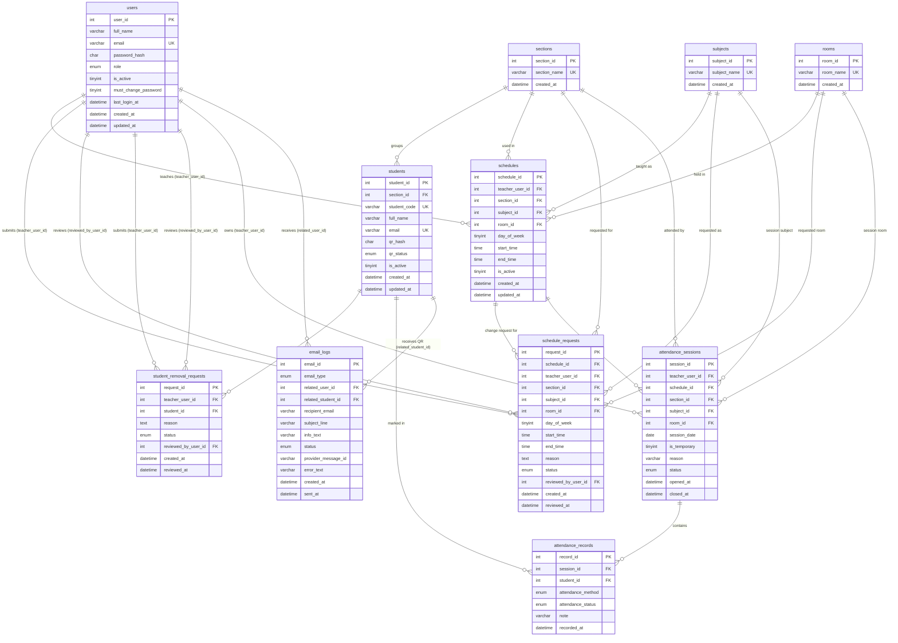

# QR Attend — Database Design

> **Engine:** MySQL / MariaDB · **Charset:** utf8mb4 · **Collation:** utf8mb4_unicode_ci
> **Schema file:** `database/qrattend_full_schema.sql`

---

## Entity Relationship Diagram



---

## Table Reference

### `users` — Admins and Teachers
| Column | Type | Notes |
|--------|------|-------|
| `user_id` | `INT` PK | Auto-increment starts at 100 (ID 1 reserved for default admin) |
| `full_name` | `VARCHAR(150)` | Display name |
| `email` | `VARCHAR(150)` | **Unique.** Used as login username |
| `password_hash` | `CHAR(64)` | SHA-256 hex of the plaintext password |
| `role` | `ENUM('ADMIN','TEACHER')` | Determines navigation and permissions |
| `is_active` | `TINYINT(1)` | Soft delete — inactive accounts cannot log in |
| `must_change_password` | `TINYINT(1)` | `1` = forced password change screen on next login |
| `last_login_at` | `DATETIME` | Updated on every successful login |

**Enum values for `role`:** `ADMIN` · `TEACHER`

---

### `sections` — Class Sections
| Column | Type | Notes |
|--------|------|-------|
| `section_id` | `INT` PK | |
| `section_name` | `VARCHAR(80)` | **Unique.** e.g., `BSIT 2A` |

> Cannot be deleted if students or active schedules reference it (`RESTRICT`).

---

### `subjects` — Subjects / Courses
| Column | Type | Notes |
|--------|------|-------|
| `subject_id` | `INT` PK | |
| `subject_name` | `VARCHAR(120)` | **Unique.** e.g., `Web Development` |

> Cannot be deleted if active schedules reference it (`RESTRICT`).

---

### `rooms` — Classrooms / Venues
| Column | Type | Notes |
|--------|------|-------|
| `room_id` | `INT` PK | |
| `room_name` | `VARCHAR(80)` | **Unique.** e.g., `Room 301` |

> Cannot be deleted if active schedules reference it (`RESTRICT`).

---

### `students` — Student Records
| Column | Type | Notes |
|--------|------|-------|
| `student_id` | `INT` PK | |
| `section_id` | `INT` FK → `sections` | Which section this student belongs to |
| `student_code` | `VARCHAR(50)` | **Unique.** School-issued ID number |
| `full_name` | `VARCHAR(150)` | |
| `email` | `VARCHAR(150)` | **Unique.** Used for QR delivery |
| `qr_hash` | `CHAR(64)` | SHA-256 of the raw QR token — **raw token is never stored** |
| `qr_status` | `ENUM('NOT_SENT','SENT','FAILED')` | Tracks QR email delivery result |
| `is_active` | `TINYINT(1)` | Soft delete — inactive students excluded from attendance |

**QR token lifecycle:**
```
generate random token  →  store sha256(token) as qr_hash  →  email raw token as QR image
                                                                ↓
                                              teacher scans → sha256(scanned) matches qr_hash
```

---

### `schedules` — Class Schedule Slots
| Column | Type | Notes |
|--------|------|-------|
| `schedule_id` | `INT` PK | |
| `teacher_user_id` | `INT` FK → `users` | The teacher who owns this class |
| `section_id` | `INT` FK → `sections` | Which section attends |
| `subject_id` | `INT` FK → `subjects` | What is being taught |
| `room_id` | `INT` FK → `rooms` | Where the class is held |
| `day_of_week` | `TINYINT` | `1`=Mon, `2`=Tue, … `7`=Sun (ISO 8601) |
| `start_time` | `TIME` | |
| `end_time` | `TIME` | Must be > `start_time` (DB CHECK constraint) |
| `is_active` | `TINYINT(1)` | Soft delete — deactivated schedules stop generating sessions |

**Index:** `(teacher_user_id, day_of_week, start_time)` — used for real-time current-class lookup.

---

### `schedule_requests` — Teacher Schedule Change Requests
| Column | Type | Notes |
|--------|------|-------|
| `request_id` | `INT` PK | |
| `schedule_id` | `INT` FK → `schedules` CASCADE | Which existing schedule is being changed |
| `teacher_user_id` | `INT` FK → `users` | Teacher who submitted the request |
| `section_id / subject_id / room_id` | FKs | Proposed new values |
| `day_of_week / start_time / end_time` | | Proposed new time slot |
| `reason` | `TEXT` | Required — teacher must explain why |
| `status` | `ENUM('PENDING','APPROVED','REJECTED')` | Default: `PENDING` |
| `reviewed_by_user_id` | `INT` FK → `users` NULL | Admin who reviewed; NULL until reviewed |
| `reviewed_at` | `DATETIME` NULL | Set when admin acts |

> On **APPROVE**: the `schedules` row is updated atomically in the same transaction.

---

### `student_removal_requests` — Teacher Student Removal Requests
| Column | Type | Notes |
|--------|------|-------|
| `request_id` | `INT` PK | |
| `teacher_user_id` | `INT` FK → `users` | Teacher who wants the student removed |
| `student_id` | `INT` FK → `students` CASCADE | Student to be removed |
| `reason` | `TEXT` | Required |
| `status` | `ENUM('PENDING','APPROVED','REJECTED')` | |
| `reviewed_by_user_id` | `INT` FK → `users` NULL | |

> On **APPROVE**: `students.is_active` is set to `0` atomically.

---

### `attendance_sessions` — Open/Closed Class Sessions
| Column | Type | Notes |
|--------|------|-------|
| `session_id` | `INT` PK | |
| `teacher_user_id` | `INT` FK → `users` CASCADE | |
| `schedule_id` | `INT` FK → `schedules` **NULL** | `NULL` for temporary (override) classes |
| `section_id` | `INT` FK → `sections` | |
| `subject_id` | `INT` FK → `subjects` | |
| `room_id` | `INT` FK → `rooms` **NULL** | `NULL` for temporary classes (no room set) |
| `session_date` | `DATE` | The calendar date of this session |
| `is_temporary` | `TINYINT(1)` | `1` = teacher manually started this class |
| `reason` | `VARCHAR(255)` NULL | Required only for temporary classes |
| `status` | `ENUM('OPEN','CLOSED')` | Default: `OPEN` |
| `opened_at` | `DATETIME` | When the session was created |
| `closed_at` | `DATETIME` NULL | Set when teacher ends or system closes |

**Session auto-creation logic:**
```
Teacher opens Attendance screen
  → system checks: is there an open temp session?     YES → use it
  → system checks: is there a matching schedule now?  YES → find or create session
  → neither                                              → show "No class open"
```

---

### `attendance_records` — Individual Attendance Marks
| Column | Type | Notes |
|--------|------|-------|
| `record_id` | `INT` PK | |
| `session_id` | `INT` FK → `attendance_sessions` CASCADE | Which session this mark belongs to |
| `student_id` | `INT` FK → `students` CASCADE | Who was marked |
| `attendance_method` | `ENUM('QR','MANUAL')` | How attendance was recorded |
| `attendance_status` | `ENUM('PRESENT','LATE')` | Status at time of recording |
| `note` | `VARCHAR(255)` | Optional teacher note (manual entry) |
| `recorded_at` | `DATETIME` | Auto-set on insert |

**Unique constraint:** `(session_id, student_id)` — one record per student per session. Duplicate attempts return a `warning`, not an error.

> ⚠️ **ABSENT is not a stored status.** A student is absent if they have **no record** for a session. `markAllAbsent()` explicitly inserts ABSENT records — check if the `absent_status_migration` has been applied to allow this value.

---

### `email_logs` — Email Audit Trail
| Column | Type | Notes |
|--------|------|-------|
| `email_id` | `INT` PK | |
| `email_type` | `ENUM('TEACHER_PASSWORD','STUDENT_QR')` | What kind of email was sent |
| `related_user_id` | `INT` FK → `users` NULL | Populated for teacher password emails |
| `related_student_id` | `INT` FK → `students` NULL | Populated for student QR emails |
| `recipient_email` | `VARCHAR(150)` | Who received it |
| `subject_line` | `VARCHAR(200)` | Email subject |
| `info_text` | `VARCHAR(255)` | Short human-readable description |
| `status` | `ENUM('QUEUED','SENT','FAILED')` | Default: `QUEUED` on insert |
| `provider_message_id` | `VARCHAR(120)` NULL | Resend API message ID on success |
| `error_text` | `VARCHAR(255)` NULL | Error detail on failure |
| `sent_at` | `DATETIME` NULL | Set when Resend confirms delivery |

**Email send flow:**
```
1. INSERT email_logs (status = QUEUED)   ← inside transaction with the main action
2. COMMIT main transaction
3. Call Resend API (outside transaction)
4. UPDATE email_logs → SENT or FAILED
```

---

## Relationship Summary

| Relationship | Type | Rule |
|-------------|------|------|
| `users` → `schedules` | One-to-Many | A teacher can have many schedules |
| `sections` → `students` | One-to-Many | A section has many students |
| `sections` → `schedules` | One-to-Many | A section can appear in multiple schedules |
| `schedules` → `attendance_sessions` | One-to-Many | Each schedule generates one session per day it runs |
| `attendance_sessions` → `attendance_records` | One-to-Many | A session has one record per student |
| `students` → `attendance_records` | One-to-Many | A student can have records across many sessions |
| `schedules` → `schedule_requests` | One-to-Many | A schedule can have multiple change requests over time |
| `students` → `student_removal_requests` | One-to-Many | A student can be targeted by multiple removal requests |
| `users` → `email_logs` | One-to-Many | Password emails link to the teacher's `user_id` |
| `students` → `email_logs` | One-to-Many | QR emails link to the student's `student_id` |

---

## ON DELETE Behavior

| FK Column | References | On Delete |
|-----------|-----------|-----------|
| `students.section_id` | `sections` | **RESTRICT** — cannot delete section with students |
| `schedules.teacher_user_id` | `users` | **CASCADE** — deleting user removes their schedules |
| `schedules.section_id` | `sections` | **RESTRICT** |
| `schedules.subject_id` | `subjects` | **RESTRICT** |
| `schedules.room_id` | `rooms` | **RESTRICT** |
| `schedule_requests.schedule_id` | `schedules` | **CASCADE** |
| `student_removal_requests.student_id` | `students` | **CASCADE** |
| `attendance_sessions.schedule_id` | `schedules` | **SET NULL** — session survives even if schedule is removed |
| `attendance_sessions.room_id` | `rooms` | **SET NULL** |
| `attendance_records.session_id` | `attendance_sessions` | **CASCADE** |
| `attendance_records.student_id` | `students` | **CASCADE** |
| `email_logs.related_user_id` | `users` | **SET NULL** — log kept even if user is deleted |
| `email_logs.related_student_id` | `students` | **SET NULL** |
| `schedule_requests.reviewed_by_user_id` | `users` | **SET NULL** — reviewer ref cleared if admin deleted |
| `student_removal_requests.reviewed_by_user_id` | `users` | **SET NULL** |

---

*Last updated: May 7, 2026*
