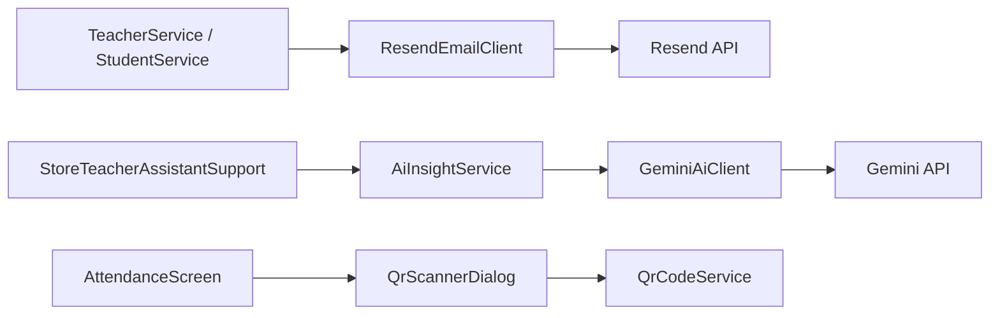

# Database Flow

This document explains how the code talks to MariaDB and outside services.

## Main Database Classes

- [`src/ppb/qrattend/db/DatabaseConfig.java`](../src/ppb/qrattend/db/DatabaseConfig.java)
- [`src/ppb/qrattend/db/DatabaseManager.java`](../src/ppb/qrattend/db/DatabaseManager.java)
- [`src/ppb/qrattend/db/DatabaseAuthenticationService.java`](../src/ppb/qrattend/db/DatabaseAuthenticationService.java)
- [`src/ppb/qrattend/db/PasswordUtil.java`](../src/ppb/qrattend/db/PasswordUtil.java)
- [`src/ppb/qrattend/db/SecurityUtil.java`](../src/ppb/qrattend/db/SecurityUtil.java)

## Database Login

Login goes through:

1. `Main.java`
2. `DatabaseAuthenticationService.authenticate(...)`
3. `users` table

The app now expects DB-backed login during normal use.

## Service -> Table Map

### TeacherService

Main tables:

- `users`
- `teacher_profiles`
- `email_dispatch_logs`
- `audit_logs`

### StudentService

Main tables:

- `student_profiles`
- `teacher_student_assignments`
- `student_qr_tokens`
- `student_roster_change_requests`
- `email_dispatch_logs`
- `audit_logs`

### ScheduleService

Main tables:

- `teacher_schedules`
- `schedule_change_requests`
- `audit_logs`

### AttendanceService

Main tables:

- `attendance_sessions`
- `attendance_records`
- `student_qr_tokens`
- `qr_scan_logs`
- `audit_logs`

### ReportService

Reads from:

- `users`
- `teacher_schedules`
- `schedule_change_requests`
- `student_roster_change_requests`
- `attendance_records`
- `email_dispatch_logs`

## External Service Flow

## QR Flow

The QR system is safer now:

- the app generates opaque random QR values
- the database stores hashed token values
- raw QR values should not be shown again after sending

Main QR files:

- [`src/ppb/qrattend/qr/QrCodeService.java`](../src/ppb/qrattend/qr/QrCodeService.java)
- [`src/ppb/qrattend/qr/QrScannerDialog.java`](../src/ppb/qrattend/qr/QrScannerDialog.java)

## Email Flow

Main files:

- [`src/ppb/qrattend/email/ResendConfig.java`](../src/ppb/qrattend/email/ResendConfig.java)
- [`src/ppb/qrattend/email/ResendEmailClient.java`](../src/ppb/qrattend/email/ResendEmailClient.java)
- [`src/ppb/qrattend/service/EmailDispatchService.java`](../src/ppb/qrattend/service/EmailDispatchService.java)

Teacher password emails and student QR emails both go through Resend.

## SQL Files

- Full setup: [`database/qrattend_full_schema.sql`](../database/qrattend_full_schema.sql)
- Student-section migration: [`database/qrattend_admin_student_sections_migration.sql`](../database/qrattend_admin_student_sections_migration.sql)
- Security cleanup migration: [`database/qrattend_security_cleanup_migration.sql`](../database/qrattend_security_cleanup_migration.sql)
