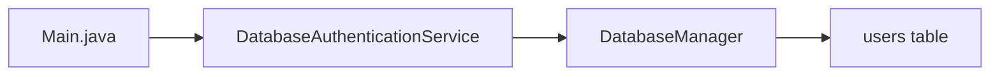
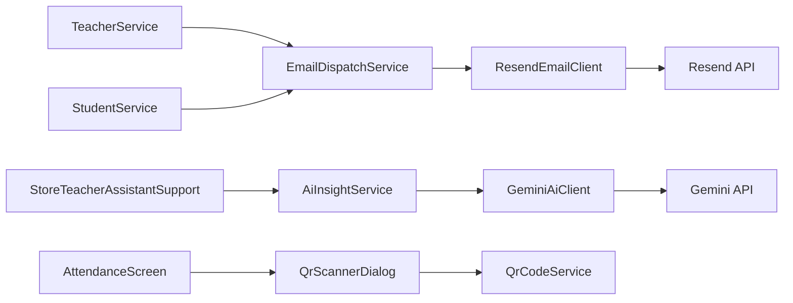

# Database Flow

This file explains how the project talks to MariaDB and outside services.

## 1. Database entry files

- [`src/ppb/qrattend/db/DatabaseConfig.java`](../src/ppb/qrattend/db/DatabaseConfig.java)
- [`src/ppb/qrattend/db/DatabaseManager.java`](../src/ppb/qrattend/db/DatabaseManager.java)
- [`src/ppb/qrattend/db/DatabaseAuthenticationService.java`](../src/ppb/qrattend/db/DatabaseAuthenticationService.java)
- [`src/ppb/qrattend/db/PasswordUtil.java`](../src/ppb/qrattend/db/PasswordUtil.java)
- [`src/ppb/qrattend/db/SecurityUtil.java`](../src/ppb/qrattend/db/SecurityUtil.java)

## 2. Login flow

In plain words:

- login starts in `Main.java`
- the authentication service checks the email and password
- MariaDB returns the matching admin or teacher account

## 3. Service to table map

### TeacherService

Main tables:

- `users`
- `teacher_profiles`
- `email_dispatch_logs`
- `audit_logs`

### StudentService

Main tables:

- `student_profiles`
- `teacher_student_assignments`
- `student_qr_tokens`
- `student_roster_change_requests`
- `email_dispatch_logs`
- `audit_logs`

### ScheduleService

Main tables:

- `teacher_schedules`
- `schedule_change_requests`
- `audit_logs`

### AttendanceService

Main tables:

- `attendance_sessions`
- `attendance_records`
- `student_qr_tokens`
- `qr_scan_logs`
- `audit_logs`

### ReportService

Reads mostly from:

- `users`
- `teacher_schedules`
- `schedule_change_requests`
- `student_roster_change_requests`
- `attendance_records`
- `email_dispatch_logs`

## 4. Outside service flow

## 5. QR flow

Important rule:

- the app should not keep raw QR secrets in normal logs or previews

Current QR direction:

- create a random QR token
- store only the hash in the database
- email the QR code to the student
- scan the QR and match by the hashed value

Main QR files:

- [`src/ppb/qrattend/qr/QrCodeService.java`](../src/ppb/qrattend/qr/QrCodeService.java)
- [`src/ppb/qrattend/qr/QrScannerDialog.java`](../src/ppb/qrattend/qr/QrScannerDialog.java)

## 6. Email flow

Main files:

- [`src/ppb/qrattend/email/ResendConfig.java`](../src/ppb/qrattend/email/ResendConfig.java)
- [`src/ppb/qrattend/email/ResendEmailClient.java`](../src/ppb/qrattend/email/ResendEmailClient.java)
- [`src/ppb/qrattend/service/EmailDispatchService.java`](../src/ppb/qrattend/service/EmailDispatchService.java)

The project uses Resend for:

- teacher password emails
- student QR code emails

## 7. SQL files

- full schema:
  - [`database/qrattend_full_schema.sql`](../database/qrattend_full_schema.sql)
- admin/student section migration:
  - [`database/qrattend_admin_student_sections_migration.sql`](../database/qrattend_admin_student_sections_migration.sql)
- security cleanup migration:
  - [`database/qrattend_security_cleanup_migration.sql`](../database/qrattend_security_cleanup_migration.sql)
