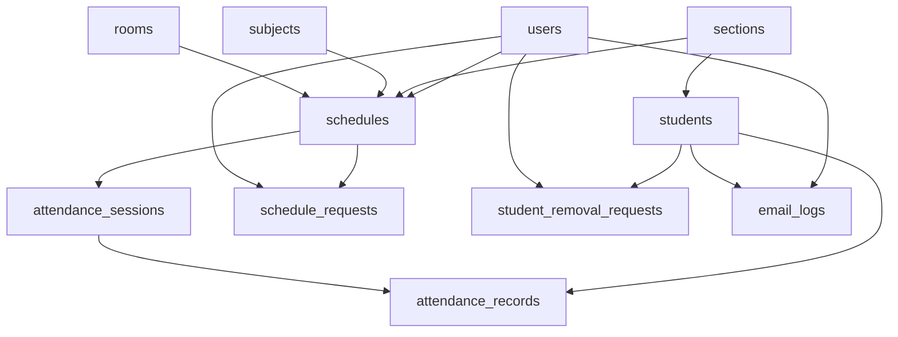

# Database

This file explains the new simple database used by QR Attend V2.

## Main Idea

The database is now small on purpose.

It keeps only the school data needed for the real flow:

- users
- sections
- subjects
- rooms
- students
- schedules
- requests
- attendance
- email log

There are no advanced tables for:

- teacher profiles
- direct teacher-student assignments
- QR token history
- scan logs
- audit logs
- IoT
- automation
- saved AI chat

## Table Map

## Tables

### `users`

Used for admin and teacher accounts.

Main columns:

- `user_id`
- `full_name`
- `email`
- `password_hash`
- `role`
- `is_active`

## `sections`

One row per section, like `BSIT-2A`.

### `subjects`

Saved subject list used by schedules.

### `rooms`

Saved room list used by schedules.

### `students`

One row per student.

Main columns:

- `student_id`
- `section_id`
- `student_code`
- `full_name`
- `email`
- `qr_hash`
- `qr_status`
- `is_active`

Important rule:

- only the QR hash is stored
- the readable QR value is used only when sending the email

### `schedules`

One row per saved class.

Main columns:

- `teacher_user_id`
- `section_id`
- `subject_id`
- `room_id`
- `day_of_week`
- `start_time`
- `end_time`
- `is_active`

This table decides:

- what class a teacher has
- what section that teacher sees
- what students belong to the current class

### `schedule_requests`

Teacher asks admin to change a saved class.

### `student_removal_requests`

Teacher asks admin to remove a student from the active class list.

### `attendance_sessions`

Stores each opened class.

There are two kinds:

- scheduled class
- temporary class

### `attendance_records`

Stores each saved student attendance row.

Main columns:

- `session_id`
- `student_id`
- `attendance_method`
- `attendance_status`
- `note`

### `email_logs`

Simple saved record of teacher password emails and student QR emails.

## Important Rules

- students belong to a section
- teachers do not own students directly
- teachers see students through the section in the current schedule
- temporary class still needs a picked section and subject
- one student should only be marked once per class session
- class-time checks use `PHT` (`Asia/Manila`)

## Fresh Setup

Run:

- [qrattend_full_schema.sql](/C:/Users/kael/Documents/NetBeansProjects/ppb.qrattend/database/qrattend_full_schema.sql)

That is the only schema file you need for the new version.
