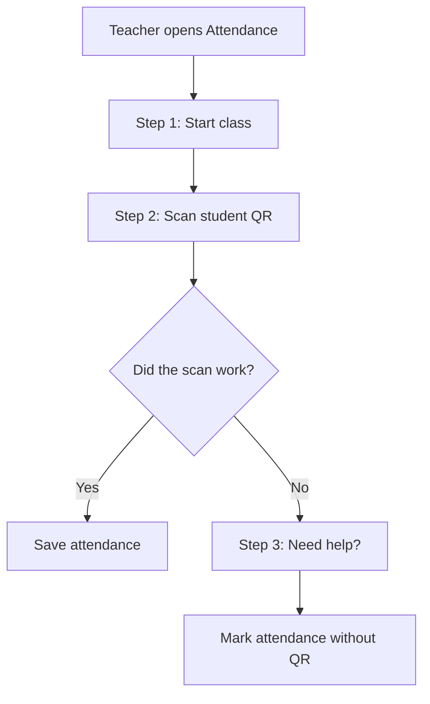

# Feature Processes

This file explains the main app features from the user's point of view and the code path behind them.

## 1. Teacher creation

User flow:

1. admin opens `Add Teacher`
2. admin types teacher name and teacher email
3. admin clicks `Add Teacher`
4. password email is sent to the teacher

Code flow:

1. `TeachersScreen`
2. `AppDataStore.addTeacher(...)`
3. `TeacherService.createTeacherAccount(...)`
4. `EmailDispatchService`
5. `ResendEmailClient`

## 2. Student creation

User flow:

1. admin opens `Add Student`
2. admin chooses the teacher
3. admin types section, student ID, full name, and email
4. admin clicks `Add Student`
5. student QR code is sent by email

Code flow:

1. `AdminStudentsScreen`
2. `AppDataStore.addStudent(...)`
3. `StudentService.createStudentProfileByAdmin(...)`
4. `EmailDispatchService`
5. `ResendEmailClient`

## 3. Schedule setup

User flow:

1. admin opens `Set Schedule`
2. admin chooses the teacher
3. admin adds subject, day, time, and room
4. admin clicks `Save Class`

Code flow:

1. `AdminSchedulesScreen`
2. `AppDataStore.addScheduleSlot(...)`
3. `ScheduleService.createApprovedScheduleSlot(...)`

## 4. Teacher schedule change request

User flow:

1. teacher opens `Schedule Help`
2. teacher chooses the class
3. teacher loads the class into the form
4. teacher changes the details
5. teacher clicks `Ask for Change`
6. admin reviews the request in `Requests`

Code flow:

1. `TeacherScheduleScreen`
2. `AppDataStore.submitScheduleChangeRequest(...)`
3. `ScheduleService.submitScheduleCorrectionRequest(...)`
4. admin uses `RequestsScreen`
5. `AppDataStore.reviewScheduleRequest(...)`

## 5. Attendance

User flow:

Code flow:

1. `AttendanceScreen`
2. `AppDataStore.getSessionForTeacher(...)`
3. `AttendanceService`
4. `QrScannerDialog` and `QrCodeService` for scanning

## 6. Student removal request

User flow:

1. teacher opens `Class List`
2. teacher chooses the student
3. teacher writes the reason
4. teacher clicks `Ask Admin`
5. admin checks it in `Requests`
6. admin approves or rejects it

Code flow:

1. `TeacherRosterScreen`
2. `AppDataStore.requestStudentRemoval(...)`
3. `StudentService.submitStudentRemovalRequest(...)`
4. `RequestsScreen`
5. `AppDataStore.reviewStudentRemovalRequest(...)`

## 7. Reports

User flow:

1. user opens `Reports`
2. user chooses a subject or keeps `All Subjects`
3. user clicks `Show Report`
4. summary and attendance records refresh

Code flow:

1. `ReportsScreen`
2. `AppDataStore.exportAttendanceSummary(...)`
3. `ReportService`

## 8. Ask AI

Teacher can ask AI inside:

- home
- attendance
- reports

User flow:

1. teacher types a question
2. teacher clicks `Ask AI`
3. the page context is gathered
4. Gemini returns a reply
5. the conversation updates on the same page

Code flow:

1. `StoreTeacherAssistantSupport`
2. `AiInsightService`
3. `GeminiAiClient`

Important safety rule:

- AI should use page facts
- AI should not receive passwords, raw QR secrets, or DB config values
