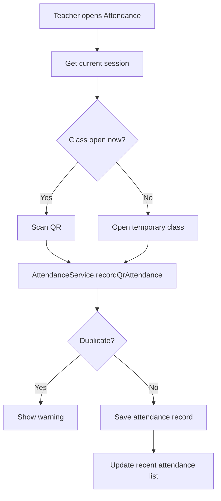

# Feature Processes

This document explains the main user flows in plain language.

## 1. Teacher Creation

Admin uses the `Teachers` screen.

Flow:

1. Admin enters teacher name and email
2. `AppDataStore.addTeacher(...)` is called
3. `TeacherService.createTeacherAccount(...)`:
   - validates input
   - creates the `users` row
   - creates the `teacher_profiles` row
   - logs the email record
   - logs the audit record
   - sends the temporary password by Resend

## 2. Student Creation

Admin uses the `Students` screen.

Flow:

1. Admin chooses the teacher
2. Admin enters section, student ID, full name, and email
3. `AppDataStore.addStudent(...)` is called
4. `StudentService.createStudentProfileByAdmin(...)`:
   - validates input
   - creates the student row
   - creates the teacher assignment row
   - creates a hashed QR token row
   - logs the email record
   - logs the audit record
   - sends the QR code by Resend

## 3. Schedule Request

Teacher uses the `My Schedule` screen.

Flow:

1. Teacher selects a class row
2. Teacher edits the subject, room, time, or reason
3. Teacher clicks `Ask for Change`
4. `ScheduleService.submitScheduleCorrectionRequest(...)` saves the request
5. Admin reviews the request in `Requests`
6. Admin approves or rejects it

## 4. Attendance

Teacher uses the `Attendance` screen.

### Attendance Without QR

If QR cannot be used:

1. Teacher selects a student from the class list
2. Teacher adds a note
3. Teacher clicks `Mark Without QR`
4. `AttendanceService.recordManualAttendance(...)` saves the record

## 5. Student Removal Request

Teacher uses `My Roster`.

Flow:

1. Teacher selects a student
2. Teacher gives a reason
3. Teacher sends the request
4. Admin reviews it in `Requests`
5. If approved, the active assignment is turned off

## 6. Ask AI

Teacher can use `Ask AI` in:

- dashboard
- attendance
- reports

Flow:

1. Teacher types a question
2. `StoreTeacherAssistantSupport` builds a small factual context
3. `AiInsightService` sends the request to Gemini
4. The reply is saved in the local conversation history
5. The chat box refreshes in the current page

Important note:

- the AI helper uses attendance/report facts
- it should not send passwords, DB config, or raw QR secrets
