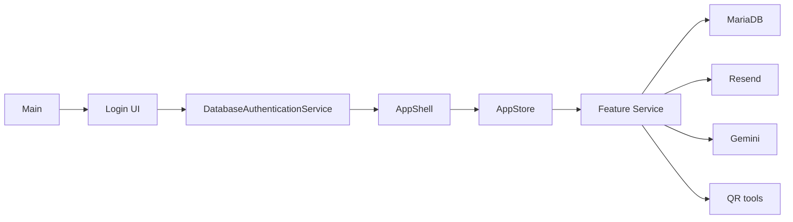

# System Overview

This app follows one simple runtime path.

## What each layer does

### `Main`

Starts the window, builds the login screen, and opens the workspace after login.

### Login UI

Shows the admin/teacher sign-in form.

### `DatabaseAuthenticationService`

Checks:

- email
- password hash
- selected role
- active account

### `AppShell`

Handles:

- small left menu
- page title
- banner message
- screen switching

It should stay simple. It is not the place for database logic.

### `AppStore`

This is the UI-facing facade.

The screens call `AppStore`.

`AppStore` then calls the service classes.

### Services

Each service handles one feature:

- `TeacherService`
- `SectionService`
- `StudentService`
- `ScheduleService`
- `AttendanceService`
- `ReportService`
- `EmailService`
- `AiChatService`

### Outside systems

- MariaDB stores app data
- Resend sends emails
- Gemini answers teacher AI questions
- QR tools build and scan QR codes

## Why this structure is easier

- screens stay focused on UI
- services stay focused on business rules
- the database is small
- the app has one active runtime path only
- there is no demo/in-memory runtime path to confuse the code
