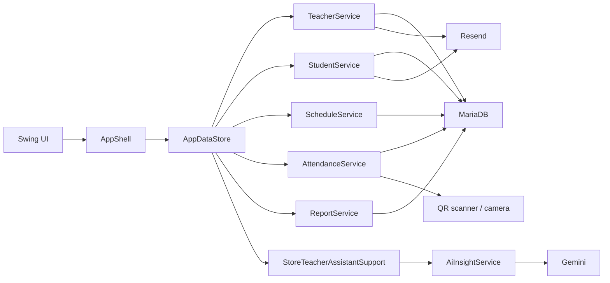

# System Overview

This file explains the whole app in simple terms.

## 1. Main idea

The project is split into four layers:

1. UI
2. store
3. services
4. database or outside APIs

## 2. Architecture

## 3. Runtime flow

In plain words:

1. `Main.java` starts the app
2. the sign in screen opens
3. `DatabaseAuthenticationService` checks the email and password
4. `AppShell` opens the admin or teacher workspace
5. the current page asks `AppDataStore` for data
6. `AppDataStore` calls the correct service class
7. service classes talk to MariaDB or outside APIs

## 4. Why AppDataStore exists

The Swing screens should not talk directly to SQL or to APIs.

So `AppDataStore` acts like one middle layer:

- screen asks the store for data
- store chooses the right service
- store returns easy UI-ready results

This keeps the screen code simpler.

## 5. Why the UI was split into small screen files

Before the refactor, too much UI logic lived in the shell.

Now the shell mainly does:

- menu
- page title
- banner messages
- right-side help panel
- switching pages

Each screen now has its own file, for example:

- admin home
- teacher home
- attendance
- students
- schedules
- requests
- reports

This makes it easier for a beginner to find the page they want to edit.

## 6. Current UX direction

The app is meant to feel simple:

- home is the main starting point
- each page has one main task first
- help and extra details stay secondary
- wording uses plain school language

The app is not trying to feel like a technical dashboard.

## 7. Important packages

- `main`
  - starts the app
- `component.login`
  - sign in UI
- `app`
  - shell and screen files
- `app.store`
  - small store helpers for messages and AI chat
- `service`
  - real business logic
- `db`
  - DB config, password hashing, security helpers
- `email`
  - Resend
- `qr`
  - QR code generation and scanning
- `model`
  - shared app data objects
