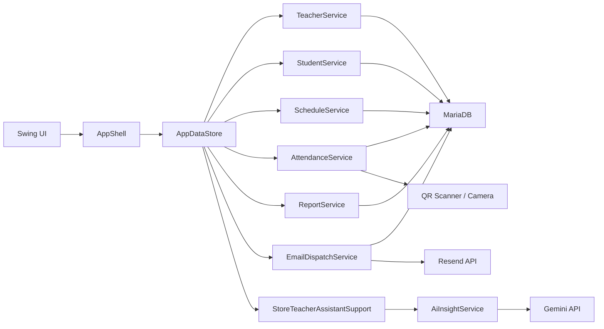

# System Overview

This document explains the main app structure in simple terms.

## Main Idea

The project is split into 4 main layers:

1. `UI`
2. `Store`
3. `Services`
4. `Database / external APIs`

## Architecture

## Runtime Flow

- `Main.java` starts the app
- `PanelCover` and `PanelLogin` show the sign-in UI
- `DatabaseAuthenticationService` checks the login against MariaDB
- `AppShell` opens the correct admin or teacher workspace
- Each screen asks `AppDataStore` for data or actions
- `AppDataStore` forwards those calls to the right service class

## Why `AppDataStore` Exists

The Swing UI should not talk directly to SQL or external APIs.

So `AppDataStore` acts like one simple middle layer:

- the UI asks for data
- the store chooses the correct service
- the store returns easy UI results

This makes the UI code easier to read.

## Why The Screen Classes Were Split

Before refactoring, `AppShell` contained:

- navigation
- header
- banner
- detail panel
- every screen builder

Now the screen builders are separated into their own files:

- admin dashboard
- teachers
- students
- schedules
- requests
- attendance
- teacher schedule
- reports

This makes it easier for a beginner to find the page they want to edit.

## Security Direction

The project now avoids showing or storing sensitive data in normal app flow:

- readable passwords are not kept in session models
- QR tokens are stored as hashes in the database
- email previews avoid secret values
- UI messages avoid raw SQL or config details

## Main Packages

- `main` -> app entry
- `component.login` -> sign-in UI
- `app` -> shell and page builders
- `app.store` -> store helpers for user messages and AI chat
- `service` -> business logic
- `db` -> database config, connection, hashing, security helpers
- `email` -> Resend integration
- `qr` -> QR generation and QR scanning
- `model` -> shared app data objects
