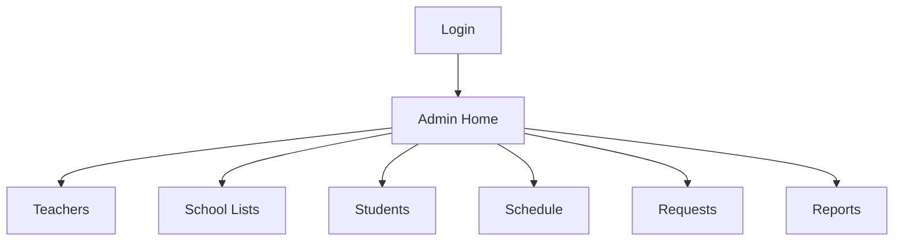
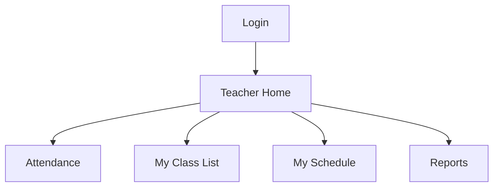
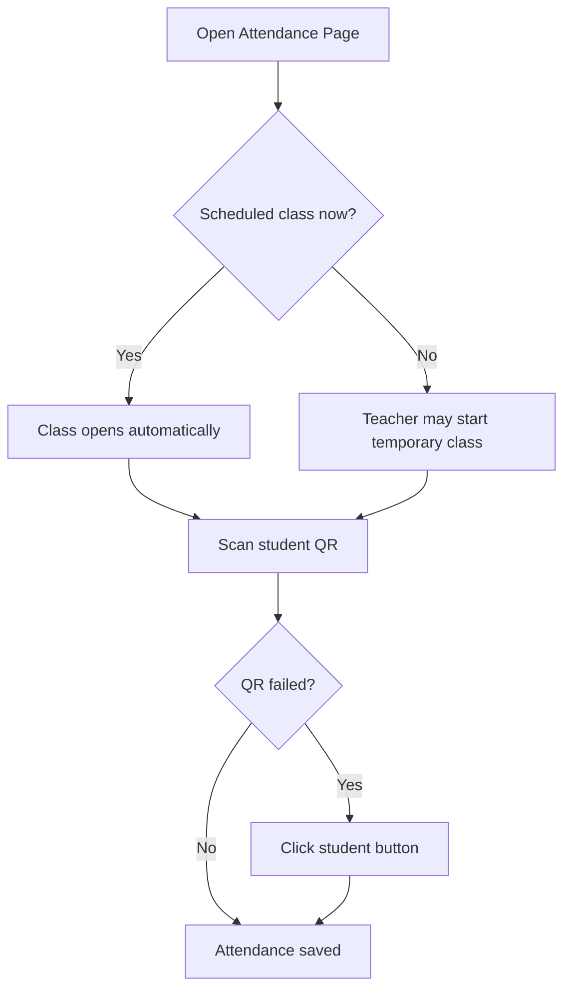

# UI Flow

This version is built to feel simple.

The user should not need to remember school data or type the same details again and again.

## Admin Flow

### Admin Home

Big next-step actions:

- Add Teacher
- Add Students
- Set Schedule
- Review Requests
- View Reports

### Teachers

- type teacher name
- type teacher email
- click add
- resend/reset password when needed

### School Lists

Admin saves:

- sections
- subjects
- rooms

These lists are reused everywhere else.

### Students

- choose section first
- import students by pasted rows
- or add one student manually
- resend QR from the list

### Schedule

Everything is picked from dropdowns:

- teacher
- section
- subject
- room
- day
- time

### Requests

Two clear groups:

- schedule requests
- student removal requests

### Reports

- choose filters
- read summary first
- check records below

## Teacher Flow

### Teacher Home

Big next-step actions:

- Start Attendance
- My Class List
- Ask for Schedule Change
- Reports

### Attendance

Important UI rules:

- one main attendance path
- no student ID typing for backup attendance
- only current class students appear in the manual list
- auto refresh checks the class again while the page is open

### My Class List

- shows students from sections in the teacher schedule
- teacher can only ask admin to remove a student

### My Schedule

- shows saved schedule
- teacher picks a class
- teacher chooses new values from saved dropdowns
- teacher sends request to admin

### Reports

- read summary
- read records
- ask AI questions about the current report
