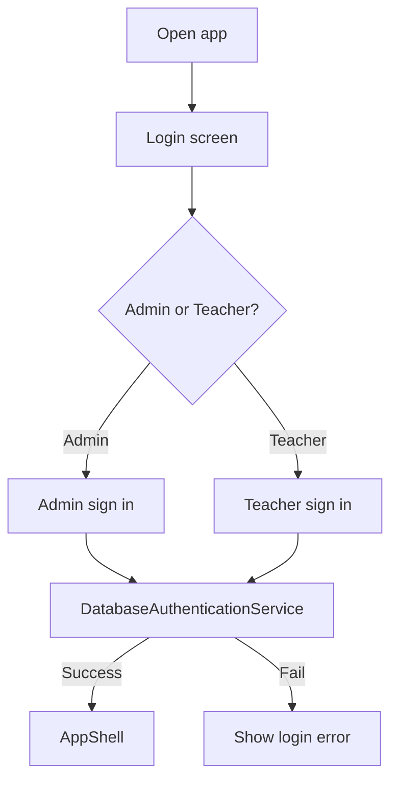

# UI Flow

This document explains what the user sees and where each screen lives in code.

## Login Flow

## Admin Screens

Admin menu:

- `Dashboard`
- `Teachers`
- `Students`
- `Schedules`
- `Requests`
- `Reports`

Admin screen files:

- [`src/ppb/qrattend/app/AdminDashboardScreen.java`](../src/ppb/qrattend/app/AdminDashboardScreen.java)
- [`src/ppb/qrattend/app/TeachersScreen.java`](../src/ppb/qrattend/app/TeachersScreen.java)
- [`src/ppb/qrattend/app/AdminStudentsScreen.java`](../src/ppb/qrattend/app/AdminStudentsScreen.java)
- [`src/ppb/qrattend/app/AdminSchedulesScreen.java`](../src/ppb/qrattend/app/AdminSchedulesScreen.java)
- [`src/ppb/qrattend/app/RequestsScreen.java`](../src/ppb/qrattend/app/RequestsScreen.java)
- [`src/ppb/qrattend/app/ReportsScreen.java`](../src/ppb/qrattend/app/ReportsScreen.java)

### What Admin Usually Does

1. Add a teacher
2. Add students by section
3. Create schedule rows
4. Approve or reject requests
5. Check reports

## Teacher Screens

Teacher menu:

- `Dashboard`
- `Attendance`
- `My Roster`
- `My Schedule`
- `Reports`

Teacher screen files:

- [`src/ppb/qrattend/app/TeacherDashboardScreen.java`](../src/ppb/qrattend/app/TeacherDashboardScreen.java)
- [`src/ppb/qrattend/app/AttendanceScreen.java`](../src/ppb/qrattend/app/AttendanceScreen.java)
- [`src/ppb/qrattend/app/TeacherRosterScreen.java`](../src/ppb/qrattend/app/TeacherRosterScreen.java)
- [`src/ppb/qrattend/app/TeacherScheduleScreen.java`](../src/ppb/qrattend/app/TeacherScheduleScreen.java)
- [`src/ppb/qrattend/app/ReportsScreen.java`](../src/ppb/qrattend/app/ReportsScreen.java)

### What Teacher Usually Does

1. Check dashboard
2. Open attendance
3. Scan QR or mark without QR
4. Review class list
5. Ask for schedule changes
6. Ask AI for help in dashboard, attendance, or reports

## Shared Shell Parts

These stay inside [`src/ppb/qrattend/app/AppShell.java`](../src/ppb/qrattend/app/AppShell.java):

- left navigation
- page title and subtitle
- success/warning banner
- right-side detail panel
- screen switching

## Login UI Files

- [`src/ppb/qrattend/component/login/PanelCover.java`](../src/ppb/qrattend/component/login/PanelCover.java)
- [`src/ppb/qrattend/component/login/PanelLogin.java`](../src/ppb/qrattend/component/login/PanelLogin.java)

The login copy was also cleaned so users do not see developer/demo wording.
