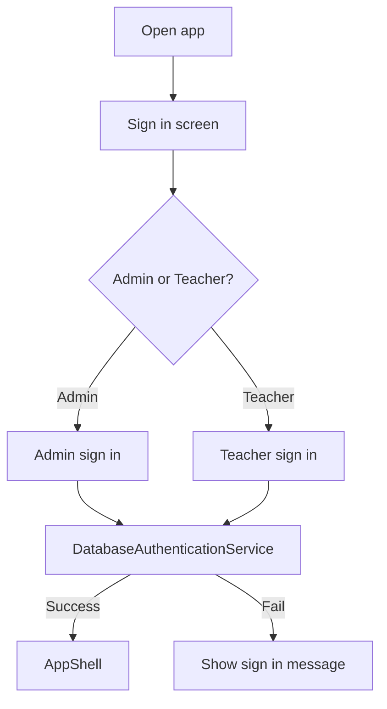
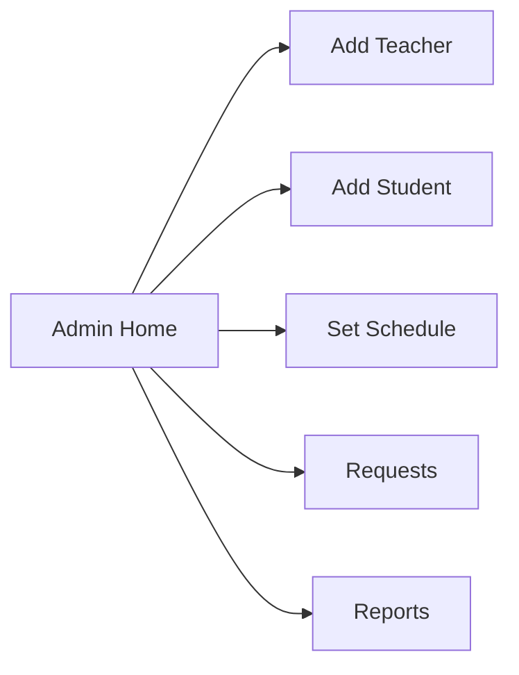
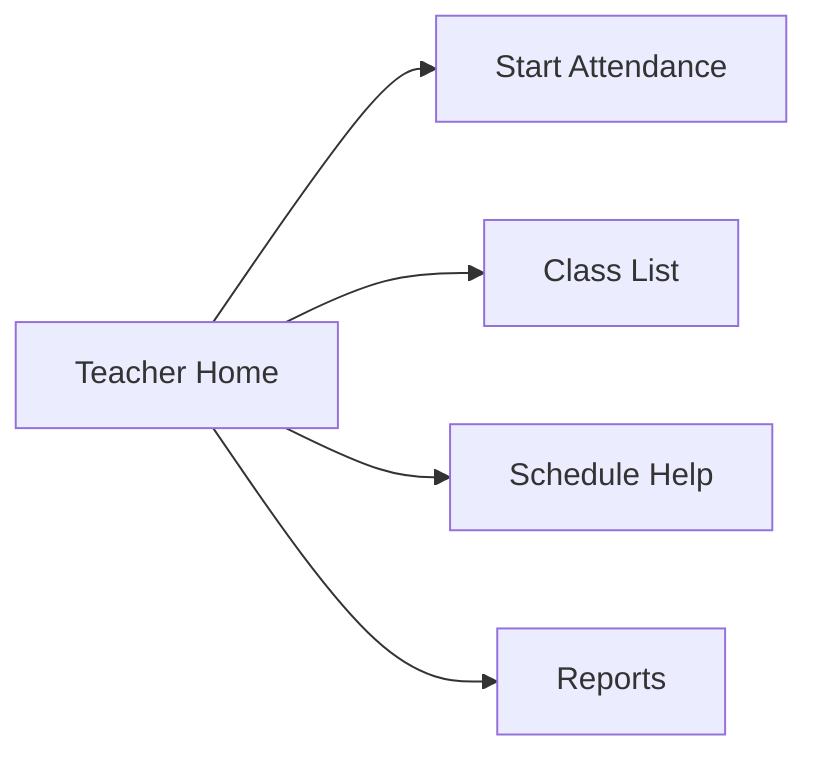
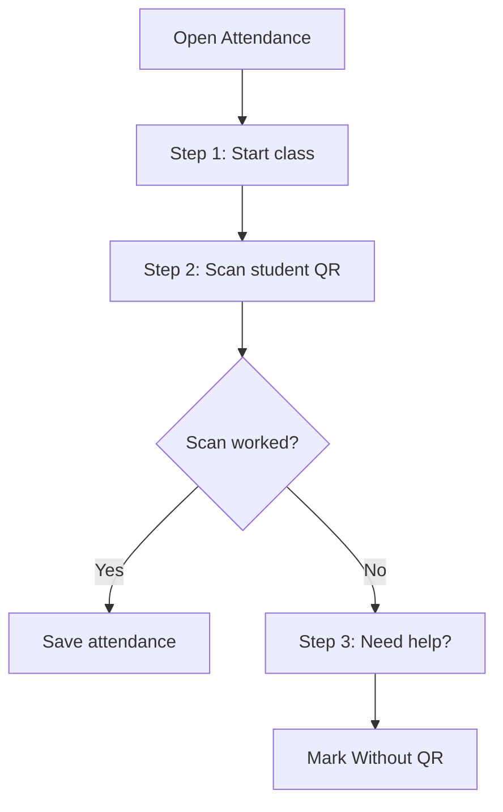

# UI Flow

This document explains what the user sees in the app and what file builds each screen.

## 1. Login flow

Login UI files:

- [`src/ppb/qrattend/component/login/PanelCover.java`](../src/ppb/qrattend/component/login/PanelCover.java)
- [`src/ppb/qrattend/component/login/PanelLogin.java`](../src/ppb/qrattend/component/login/PanelLogin.java)

## 2. Main workspace flow

The app now uses a simple task-first layout:

- left side: small menu
- center: current page
- right side: help, recent activity, or next steps

Main shell file:

- [`src/ppb/qrattend/app/AppShell.java`](../src/ppb/qrattend/app/AppShell.java)

## 3. Admin flow

Admin home is the main starting point.

Admin usually follows this order:

1. add a teacher
2. add students
3. set class schedules
4. review requests
5. check reports

Admin screen files:

- [`src/ppb/qrattend/app/AdminDashboardScreen.java`](../src/ppb/qrattend/app/AdminDashboardScreen.java)
- [`src/ppb/qrattend/app/TeachersScreen.java`](../src/ppb/qrattend/app/TeachersScreen.java)
- [`src/ppb/qrattend/app/AdminStudentsScreen.java`](../src/ppb/qrattend/app/AdminStudentsScreen.java)
- [`src/ppb/qrattend/app/AdminSchedulesScreen.java`](../src/ppb/qrattend/app/AdminSchedulesScreen.java)
- [`src/ppb/qrattend/app/RequestsScreen.java`](../src/ppb/qrattend/app/RequestsScreen.java)
- [`src/ppb/qrattend/app/ReportsScreen.java`](../src/ppb/qrattend/app/ReportsScreen.java)

## 4. Teacher flow

Teacher home is also the main starting point.

Teacher usually follows this order:

1. start attendance
2. scan student QR codes
3. use help only if QR fails
4. check class list or schedule if needed
5. read reports and ask AI if something looks wrong

Teacher screen files:

- [`src/ppb/qrattend/app/TeacherDashboardScreen.java`](../src/ppb/qrattend/app/TeacherDashboardScreen.java)
- [`src/ppb/qrattend/app/AttendanceScreen.java`](../src/ppb/qrattend/app/AttendanceScreen.java)
- [`src/ppb/qrattend/app/TeacherRosterScreen.java`](../src/ppb/qrattend/app/TeacherRosterScreen.java)
- [`src/ppb/qrattend/app/TeacherScheduleScreen.java`](../src/ppb/qrattend/app/TeacherScheduleScreen.java)
- [`src/ppb/qrattend/app/ReportsScreen.java`](../src/ppb/qrattend/app/ReportsScreen.java)

## 5. Attendance page flow

The attendance page was simplified into three steps:

Important note:

- the teacher should mainly use the scan section
- the help section is only for backup/manual attendance

## 6. Shared UI helper files

- [`src/ppb/qrattend/app/AppTheme.java`](../src/ppb/qrattend/app/AppTheme.java)
  - colors, buttons, tables, borders, fonts
- [`src/ppb/qrattend/app/AppFlowPanels.java`](../src/ppb/qrattend/app/AppFlowPanels.java)
  - simple action tiles
  - simple helper panels
